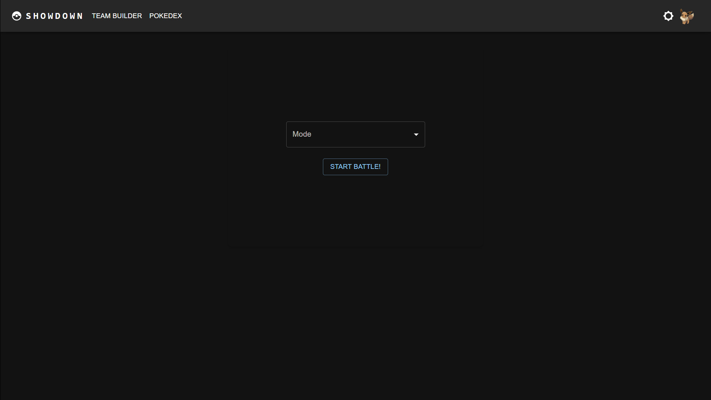
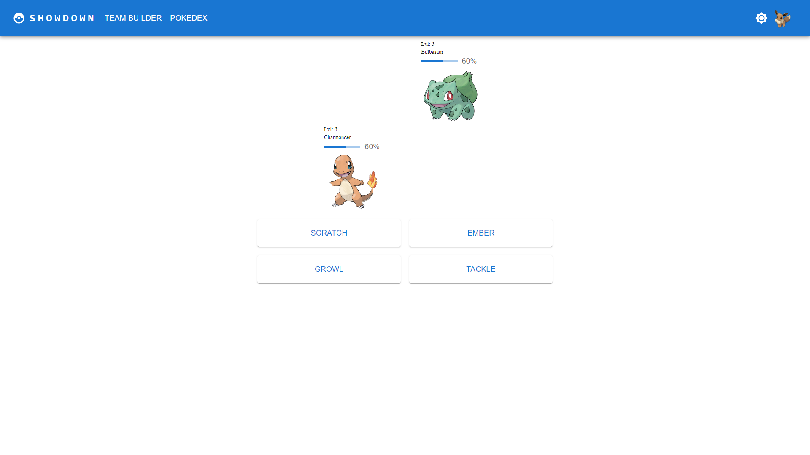

# SHOWDOWN

Pokemon and Showdown has been a part of my teenage-hood. This project is my attempt to remake that vision I have from my point of view and how we can have fun competitive pokemon battle in a simple environment.

Live Link: https://pokemon-showdown-seven.vercel.app/

## Table of Contents

- [Features](#features)
- [Screenshots](#screenshots)
- [Installation](#installation)

## Features

- **Ability to login**: Sign up and log in.
- **Your Personal Team**: Create and customize your own team.
- **Real-time Battle**: Real-time pokemon battle.

## Screenshots


_Home Page_


_BattleZone Page_

## Installation

To get a local copy up and running, follow these steps:

1. **Clone the repository**
   ```sh
   git clone https://github.com/himanshu3232/Pokemon_Showdown.git
   cd showdown
   ```
2. **Install dependencies**

```sh
npm install
```

3. **Start the development server**

```sh
npm run dev
```